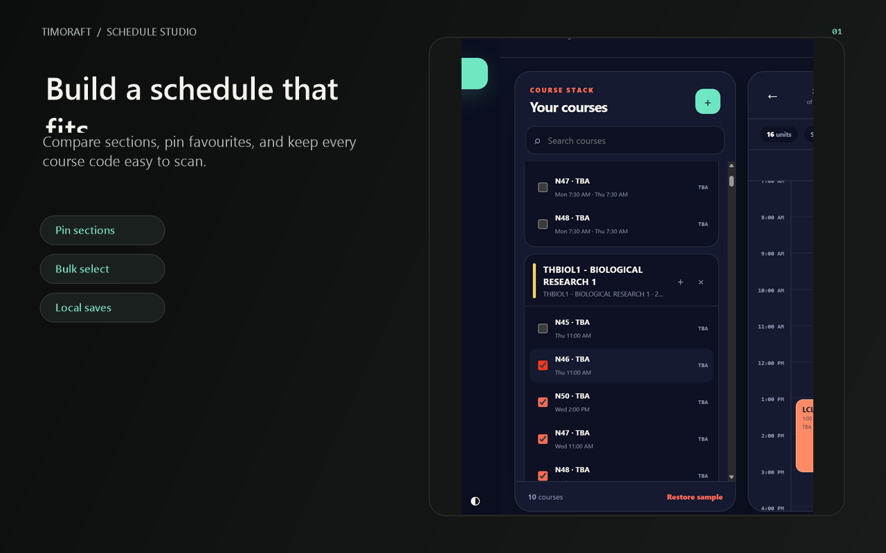
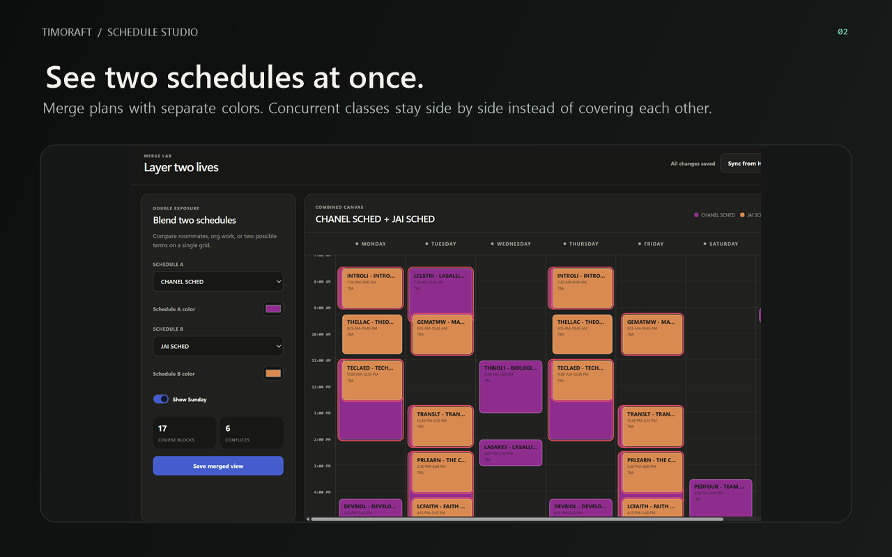
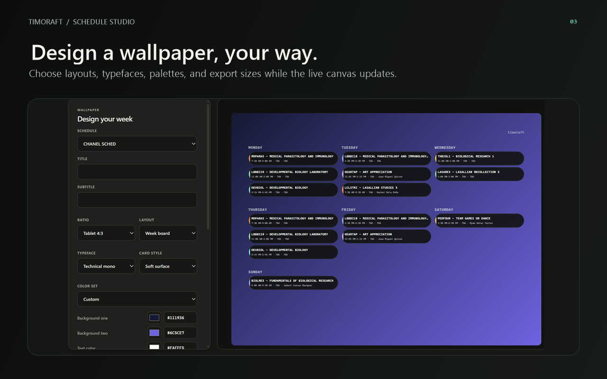
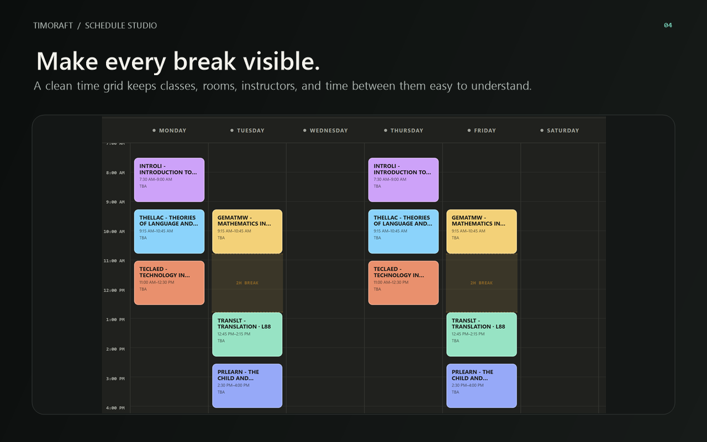
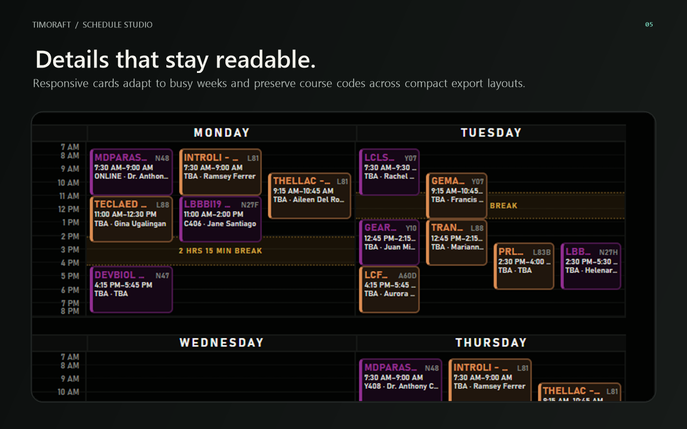

# Timoraft

Timoraft is a local-first Chrome schedule studio for building conflict-free
class combinations, layering two saved schedules, and creating custom schedule
wallpapers. Its visual identity and interface are intentionally distinct from
Slottle.

## Screenshots

| Build your schedule | Merge two schedules |
|:---:|:---:|
|  |  |

| Customize wallpapers | Time grid and break labels |
|:---:|:---:|
|  |  |

## Features

- Generates up to 250 conflict-free combinations in a cancellable background
  worker, keeping the interface responsive even with large course catalogs.
- Select or deselect every section globally, or use per-course **All** and
  **None** controls without triggering repeated full-page renders.
- New sections begin deselected. Unlimited top-choice pins move preferred
  sections first in generated results and use a distinct green treatment.
- Archer's Hub sections show live enlisted/capacity counts, accessible progress
  meters, and a red **Full** state without preventing selection. Imported
  courses support individual and bulk refresh, retain the last known data when
  disconnected, and show a dedicated reconnect state when the Hub session ends.
- Course cards can be minimized individually to keep large catalogs manageable.
- Monday–Saturday grid with optional Sunday display in Builder, Merge Lab, and
  Wallpaper Studio.
- The main navigation can collapse into a compact icon rail, remembers that
  preference locally, and expands again without leaving the current workspace.
- Manual course and section creation with professor, room, units, and color.
- Optional Archer's Hub catalog sync for signed-in users, including campus and
  term selection plus section import; the authenticated requests stay inside
  the extension and its permitted Hub origin.
- Merge Lab combines two locally saved schedules, lets you choose a separate
  color for each person, places simultaneous classes in separate lanes, and
  ignores cross-person conflicts. Only invalid overlaps inside the same saved
  schedule are flagged.
- Wallpaper Studio includes desktop, standard phone, tall phone, extra-tall
  phone, tablet, and square ratios; board,
  split-week, agenda, time-grid, compact-timetable, neon weekly-grid, and pastel
  dark-grid layouts; ten local
  typeface stacks; curated color
  sets; native color wheels; editable hex codes; color extraction from uploaded
  images; card styling; and an optional Timoraft mark.
- Phone PNGs use a responsive two-column weekly composition instead of squeezing
  every day into one row. An adjustable lock-screen safe area keeps the clock
  and notifications clear, while a content-scale control adapts typography and
  card density to the selected canvas.
- Time-grid previews and PNGs include optional labeled daily breaks and work at
  desktop, phone, tablet, and square sizes. Course code, section, room, and
  professor text can be corrected per wallpaper before export without altering
  the original saved schedule.
- Repeated sections can be edited meeting by meeting before export, so each day
  can have its own time, classroom or online mode, and professor. Short Sunday
  meetings keep those details visible across every wallpaper layout.
- The neon weekly grid adds a black shared time rail, crisp day columns,
  translucent course-color cards, highlighted break bands, a units footer, and
  responsive three- or two-day groupings that stay legible on tablets and phones.
- The pastel dark grid adds a charcoal timetable, dotted day headings, solid
  pastel cards, amber break bands, and the same adaptive day grouping across
  desktop, tablet, square, standard-phone, and tall-phone PNG exports.
- Both dark time-grid layouts give short classes a responsive minimum card
  height, preserve every course's true start and end time in the text, and use
  extra lanes when needed so section, time, room, and professor details remain
  visible without cards covering each other.
- Course codes are rendered as protected, high-contrast labels separate from
  optional titles. Narrow merged lanes shorten secondary text first and keep
  the full code visible in both the preview and exported PNG.
- Wallpaper edits can be saved as named local designs, reloaded, updated, and
  deleted. Each saved design keeps its schedule choice, layout, device ratio,
  colors, image, sizing, visibility settings, and per-meeting text corrections.
- Wallpaper cards use a consistent detail hierarchy for course code, section,
  time, room, professor, and course title. Dense and merged schedules scale down
  automatically and are clipped safely inside each day instead of overflowing.
- Local schedule library with load, delete, wallpaper, JSON backup, and JSON
  restore actions.
- Automatic local persistence through `chrome.storage.local`, with a
  `localStorage` fallback for ordinary web previews.
- Light and dark interface modes.

## Load it in Chrome

1. Open `chrome://extensions`.
2. Turn on **Developer mode**.
3. Choose **Load unpacked**.
4. Select the `extension` folder in this project.
5. Click the Timoraft toolbar icon to open the studio in a reusable tab.

After replacing files in an already loaded unpacked copy, click the extension's
**Reload** button on `chrome://extensions` before testing the updated UI.

## Archer's Hub search

Sign in to Archer's Hub in Chrome first. In Timoraft, choose **Sync from Hub**
from the Builder toolbar, or open **Add course** and choose **Search and add
from Archer's Hub instead**. Select a campus and term, search the catalog, and
add the course and its available sections to the builder.

## Source layout

- `extension/manifest.json` — Chrome Manifest V3 configuration.
- `extension/background.js` — app-tab lifecycle and authenticated Archer's Hub
  request bridge.
- `extension/sidepanel.html` — semantic application shell.
- `extension/sidepanel.js` — schedule generator, merge engine, storage, backup,
  wallpaper renderer, and UI behavior.
- `extension/schedule-worker.js` — bounded, cancellable conflict-free schedule
  search that runs away from the UI thread.
- `extension/assets/app.css` — responsive Timoraft visual system.
- `extension/icons/` — new Timoraft identity and toolbar assets.
- `scripts/generate-icons.ps1` — reproducibly renders PNG icons from the visual
  concept.

## Naming note

“Timoraft” is a coined name. Exact-match searches for the name, including
general web, Chrome Web Store, GitHub, and trademark-oriented queries, returned
no results on September 7, 2026. That is not a legal trademark clearance; run a
formal search in the jurisdictions where you plan to publish.

## Attribution

The original Slottle extension was used as a behavioral reference and is
distributed under the MIT License by Amane Kai. This repository retains the
applicable license notice for attribution; downloaded development reference
packages are not included in the public source. Timoraft's UI, icon, schedule
merge workflow, Sunday controls, local library, and wallpaper studio are newly
implemented here.

## Privacy

Timoraft stores schedules, preferences, and user-selected wallpaper images
locally. Archer's Hub is contacted only for user-requested search, import, or
refresh actions. See the complete [Privacy Policy](PRIVACY.md).

Timoraft is not affiliated with De La Salle University or MasterSoft.
